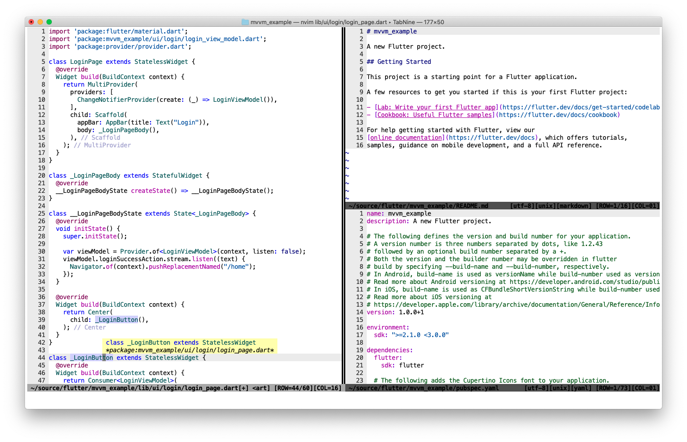
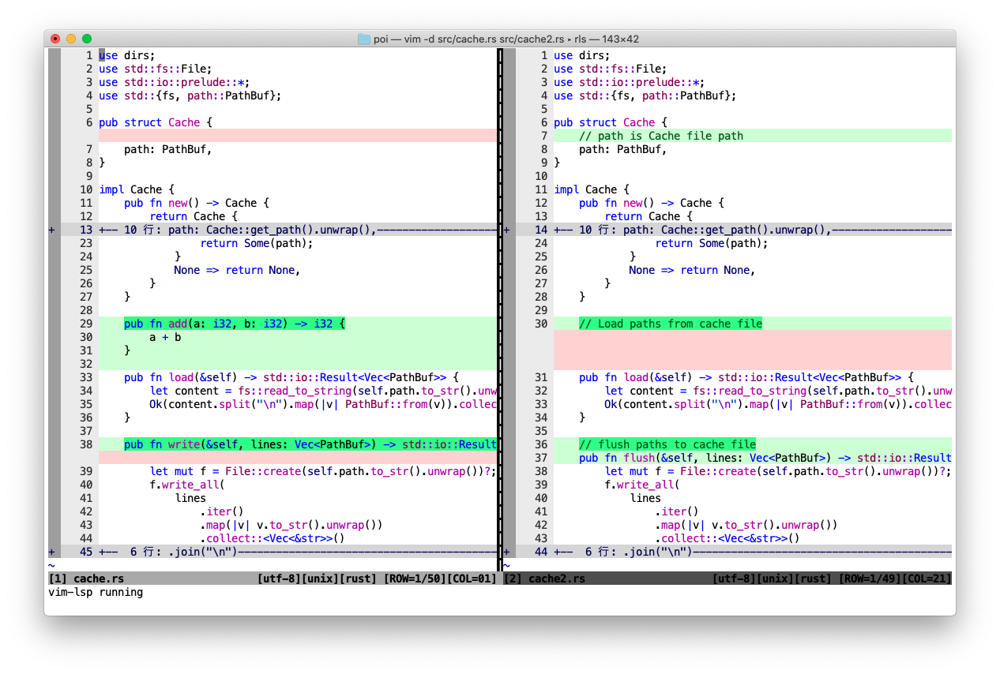

<p align="center">
    <h2 align="center">notelight</h2>
    <p align="center">notelight is good contrast light colorscheme for Vim and Neovim!</p>
</p>


- Supports Windows, macOS and Linux!
- Supported CUI and GUI.



## Supported Plugins Color⛏

- [✔] Markdown https://github.com/plasticboy/vim-markdown
- [✔] NERDTree https://github.com/preservim/nerdtree
- [✔] NERDTree + vim-devicons https://github.com/ryanoasis/vim-devicons
- [✔] dart-vim-plugin https://github.com/dart-lang/dart-vim-plugin
- [✔] vim-lsp https://github.com/prabirshrestha/vim-lsp
- [✔] coc.nvim https://github.com/neoclide/coc.nvim
- [✔] coc-flutter https://www.npmjs.com/package/coc-flutter
- [✔] vim-go https://github.com/fatih/vim-go

## Install

If you use any vim plugin manager, refer to the following.

**vim-plug**

```vim
Plug 'yasukotelin/notelight'
```

**dein.vim**

```vim
call dein#add('yasukotelin/notelight')
```

Finally, Write to your `.vimrc` or `init.vim`.

```vimrc
colorscheme shirotelin
```

## Features

### Diff

Supported diff color 🤷‍♂️



## Licence

MIT Licence

## Author

yasukotelin
